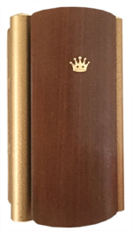
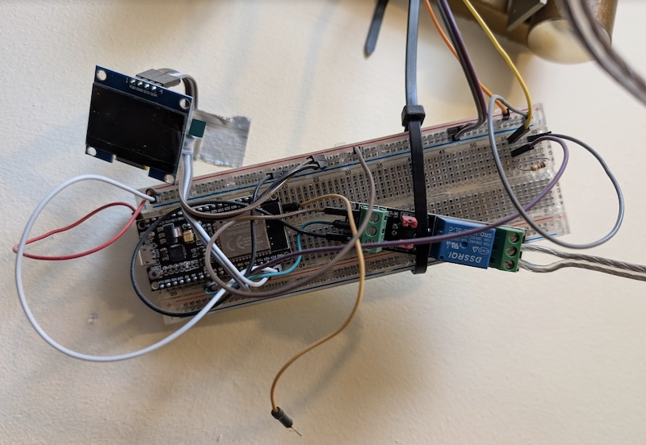
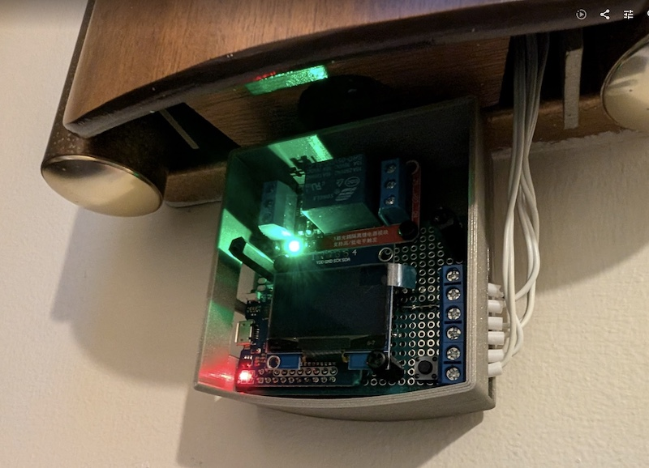
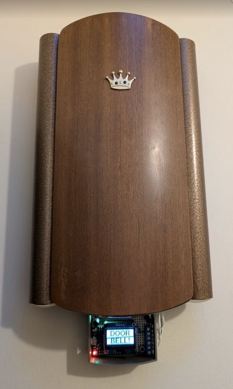

# Retro Doorbell

An ESP32 solution to fix a retro doorbell. It:

- Holds the doorbell chime circuit closed for 3 seconds, to ensure it chimes
- Publishes an MQTT message to allow home automations

## Why?

- Our doorbell chime has a massive flaw, it doesn't ring unless you hold down
  the button for ~3 seconds!
- It allows us to keep the old doorbell chime, it has lots of character
- It allows us to trigger home automations such as playing a sound through the
  home music system, sending notifications, etc

## The Doorbell Chime

This will work with any standard chime, but the particular one this was built
for is a 1961 Friedland Westminster Mark II Model 60.

## The Iterations

### V1

### V2

## The Hardware

- ESP32
- 3.3v DC / 12v AC relay with optocoupler
- 10KΩ resistor
- a 5v ~1A power supply for the ESP32

## The Circuits

The doorbell is split into 2 circuits:

1. Doorbell push button -> ESP32 5V -> DC control side of relay
2. Doorbell chime -> 12V AC power -> AC appliance side of relay

2 ESP32 GPIO pins are used:

1. Pin 17 detects the doorbell button push
2. Pin 16 controls the relay

## The Program

To help with reliability:

- The doorbell button and chime still operate if WiFi is disconnected
- The device occasionally checks if WiFi is connected and reboots if it is not
- The loop avoids blocking

## Web API

- `GET /status` view JSON status data: config, system
- `PUT /reboot` reboot the device
- `PUT /reset` forget the WiFi & MQTT config and reboot

## Development

Install platformio core and refer to the `Makefile` for common dev commands.

See https://platformio.org/install/cli. I used `brew install platformio`.

- `make compile` compile the code
- `make upload` compile and flash to the device
- `make erase` fully erase the device flash, a factory reset
- `make serial` watch the serial output log
